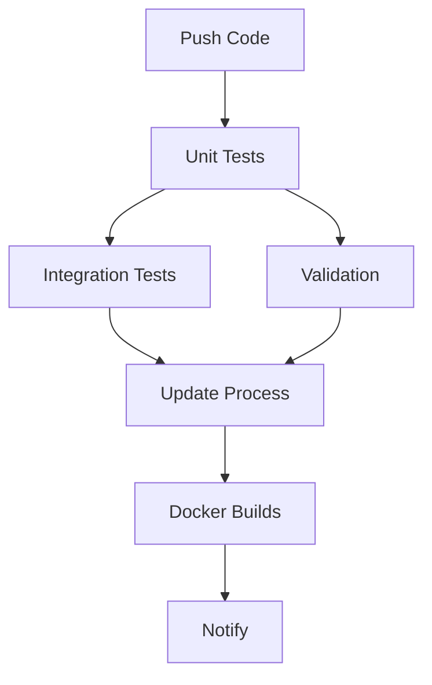

# GitHub Actions CI/CD

## Overview
This directory contains our Continuous Integration/Continuous Deployment (CI/CD) workflows. These automated processes help ensure code quality and system reliability by running tests and validations whenever code changes are pushed.

## Main Workflow: test.yml

### When It Runs
The workflow triggers on:
- Every push to the `main` branch
- Every pull request targeting the `main` branch

### Job Sequence


### Jobs Explained

#### 1. Unit Tests
```yaml
job: unit-tests
```
- Fastest running tests
- Tests individual components in isolation
- No database or network required
- Good for catching basic code issues quickly

#### 2. Integration Tests
```yaml
job: integration-tests
```
- Tests how services work together
- Requires running containers
- Takes longer than unit tests
- More realistic testing environment

#### 3. Configuration Validation
```yaml
job: validation
```
- Checks configuration files
- Validates Docker setups
- Ensures consistent settings
- Prevents configuration errors

#### 4. Update Process Test
```yaml
job: update-process
```
- Tests version updates
- Verifies update manifests
- Checks rollback procedures
- Ensures safe updates

#### 5. Docker Build Tests
```yaml
job: docker-builds
```
- Builds all containers
- Tests service startup
- Verifies container health
- Checks system deployment

## Viewing Results

### GitHub Interface
1. Go to repository's "Actions" tab
2. Click on latest workflow run
3. Expand job details to see:
   - Test results
   - Build logs
   - Error messages

### Understanding Status Checks
- ✅ Green check: All tests passed
- ❌ Red X: Tests failed
- 🟡 Yellow dot: Tests running

## Common Issues

### Failed Unit Tests
```bash
job: unit-tests failed
```
1. Check test output in job logs
2. Look for failed assertions
3. Fix code and push changes

### Integration Test Failures
```bash
job: integration-tests failed
```
1. Check if services started
2. Verify container logs
3. Check network connectivity

### Docker Build Issues
```bash
job: docker-builds failed
```
1. Check Dockerfile syntax
2. Verify build context
3. Check dependency versions

## Maintaining the Workflow

### Adding New Tests
1. Add test files to appropriate directory:
   ```
   tests/
   ├── unit/          # Unit tests
   ├── integration/   # Integration tests
   └── validation/    # Validation tests
   ```

2. Update workflow if needed:
   ```yaml
   - name: Run new tests
     run: |
       pytest tests/new_test_directory/
   ```

### Adding New Jobs
1. Define job in test.yml:
   ```yaml
   new-job:
     name: New Job
     runs-on: ubuntu-latest
     steps:
       - uses: actions/checkout@v3
       # Add steps...
   ```

2. Add job dependencies:
   ```yaml
   needs: [job1, job2]
   ```

### Modifying Triggers
Change when workflow runs:
```yaml
on:
  push:
    branches: [ main, develop ]
  pull_request:
    branches: [ main ]
  schedule:
    - cron: '0 0 * * *'  # Daily
```

## Best Practices

1. **Keep Tests Fast**
   - Unit tests < 5 minutes
   - Full workflow < 30 minutes

2. **Fail Early**
   - Run fast tests first
   - Validate configs before builds

3. **Clear Outputs**
   - Use descriptive test names
   - Log meaningful messages
   - Include relevant context

4. **Resource Usage**
   - Clean up containers
   - Remove build artifacts
   - Use caching when possible

5. **Security**
   - Never commit secrets
   - Use GitHub Secrets
   - Limit permissions

## Getting Help

1. Check workflow logs in GitHub Actions tab
2. Review job-specific documentation
3. Search GitHub Actions marketplace
4. Check GitHub Actions documentation
