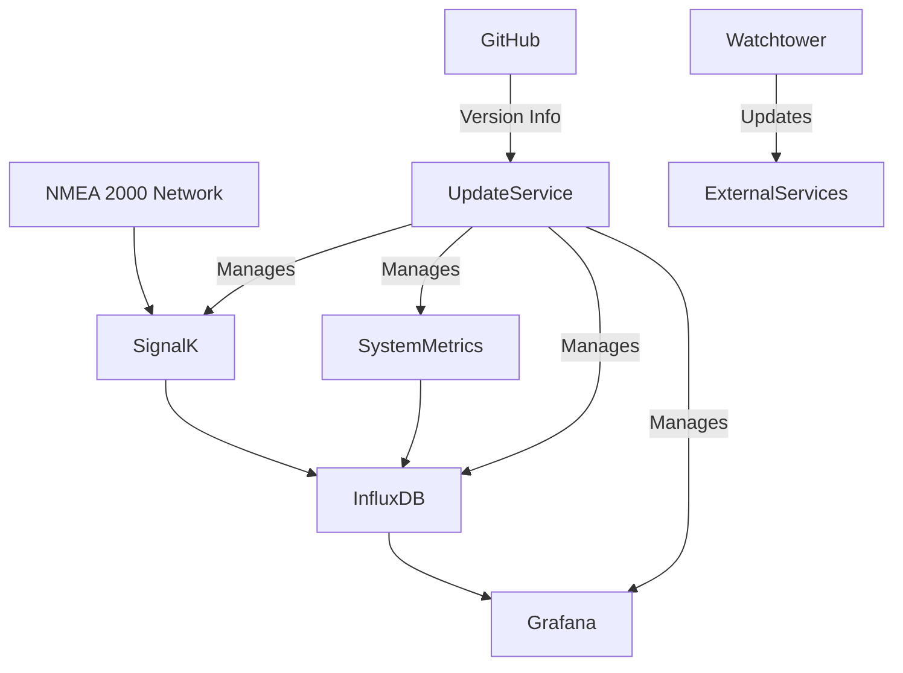
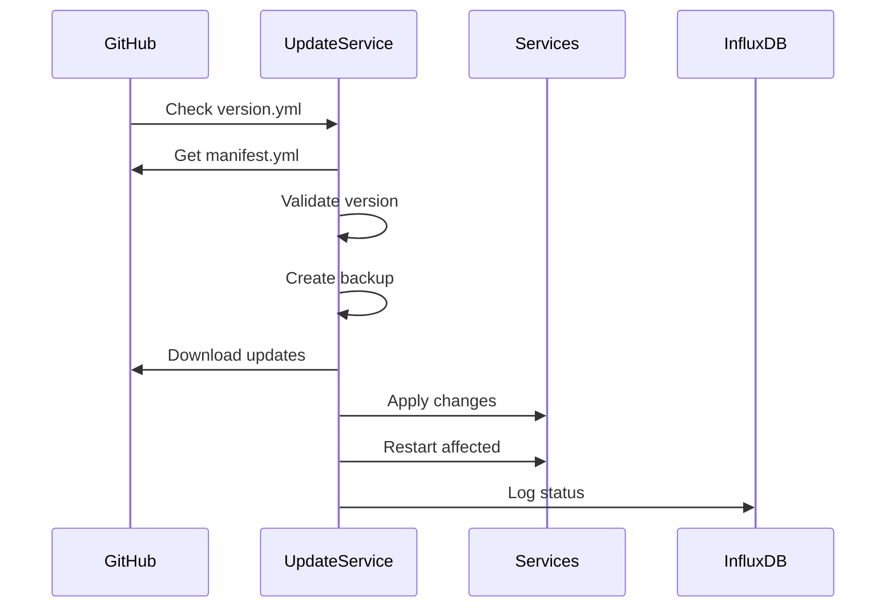
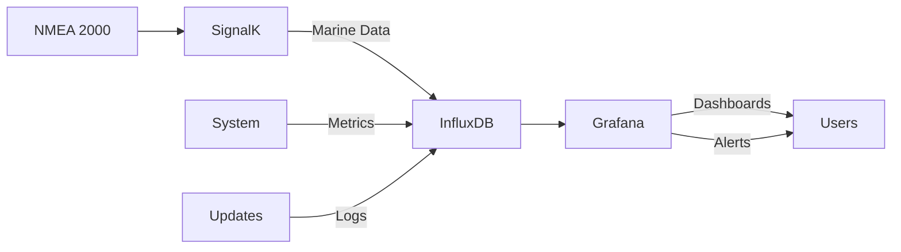

# Data Hub Architecture

## System Overview

The Data Hub is designed as a microservices architecture running on Docker, with each service responsible for specific functionality. The system is built to be maintainable, scalable, and self-updating.

## Core Components

### 1. Data Collection & Processing
- **SignalK Server**
  - Interfaces with NMEA 2000 network
  - Normalizes marine data
  - Provides real-time data access
  - Forwards data to InfluxDB

- **System Metrics Collector**
  - Monitors system performance
  - Collects CPU, memory, disk metrics
  - Monitors temperature
  - Stores metrics in InfluxDB

### 2. Data Storage & Visualization
- **InfluxDB**
  - Time-series database
  - Stores marine data
  - Stores system metrics
  - Stores update logs
  - Retention policies per data type

- **Grafana**
  - Visualizes time-series data
  - Custom dashboards
  - Alert configuration
  - Historical analysis

### 3. System Management
- **Update Service**
  - Monitors GitHub for updates
  - Validates version requirements
  - Manages service configurations
  - Handles file permissions
  - Controls service restarts
  - Provides rollback capability

- **Watchtower**
  - Monitors external container images
  - Handles external service updates
  - Coordinates with update service
  - Label-based monitoring

## Update Flow

1. Update service checks GitHub for new versions
2. Downloads and validates update manifest
3. Creates system backup
4. Applies updates in order specified by manifest
5. Restarts affected services
6. Logs update status to InfluxDB

## Data Flow

### Marine Data Flow
1. NMEA 2000 data received through PICAN-M
2. SignalK processes and normalizes data
3. Data stored in InfluxDB
4. Visualized in Grafana

### System Metrics Flow
1. Collector gathers system metrics
2. Metrics stored in separate measurements
3. Data tagged for efficient querying
4. Displayed in system dashboards

### Update Logs Flow
1. Update service logs operations
2. Status stored with timestamps
3. Errors captured with details
4. Viewable in update dashboard

## Service Interaction

### Direct Dependencies
- SignalK → InfluxDB (data storage)
- SystemMetrics → InfluxDB (metrics storage)
- Grafana → InfluxDB (data source)
- UpdateService → InfluxDB (logging)

### Management Dependencies
- UpdateService → All Services (updates)
- Watchtower → External Services (updates)

## Security Considerations

### Network Security
- NMEA 2000 access restricted to SignalK
- InfluxDB internal to Docker network
- Grafana password protected
- Update service validates GitHub sources

### File Security
- Service-specific file permissions
- Configuration file protection
- Backup preservation
- Secure update application

## Development Guidelines

### Adding New Services
1. Create service directory structure
2. Include service-specific documentation
3. Define Docker configuration
4. Update compose file
5. Add update manifest support

### Service Requirements
- Docker containerization
- Health check endpoints
- Metric collection
- Update compatibility
- Documentation

## Monitoring & Maintenance

### System Health
- Service status monitoring
- Resource usage tracking
- Temperature monitoring
- Update status logging

### Backup & Recovery
- Automated backups
- Version-specific backups
- Rollback procedures
- Data persistence

## Future Considerations

### Scalability
- Additional marine protocols
- Enhanced metrics collection
- Extended data retention
- Advanced visualizations

### Reliability
- Improved error handling
- Enhanced backup systems
- Automated testing
- Health check improvements
