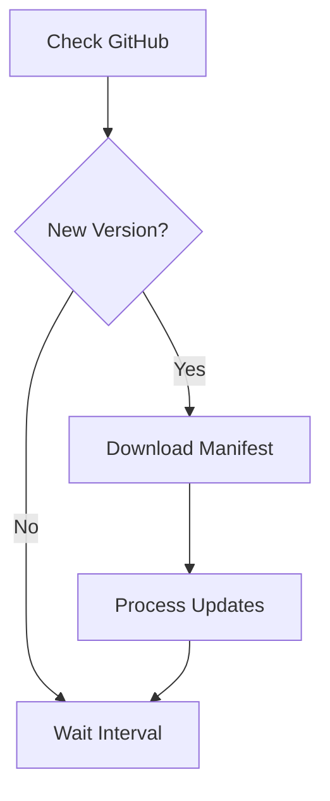

# Data Hub Update System

## Overview

The Data Hub includes an automated update system that manages version updates, service configurations, and system maintenance. This document describes the update system architecture and operation.

## Components

### 1. Update Service
Located in `services/update-service/`, this service:
- Monitors the GitHub repository for updates
- Compares local and remote versions
- Applies updates based on manifest files
- Manages service restarts
- Logs update status to InfluxDB

### 2. Version Control
Version information is managed through:
- `version.yml`: Current system version
- `updates/[version]/manifest.yml`: Version-specific update instructions

### 3. Watchtower
Manages external container updates:
- Monitors labeled container images for updates (com.centurylinklabs.watchtower.enable=true)
- Automatically pulls new versions of external images
- Handles container restarts for external services
- Cleans up old images
- Runs on hourly interval (coordinated with update service)

Note: Custom-built services are managed by the update service and have Watchtower monitoring disabled (com.centurylinklabs.watchtower.enable=false)

## Version Management

### Version Format
Versions follow semantic versioning (MAJOR.MINOR.PATCH):
```yaml
version: "1.1.0"
```

### Manifest Structure
Each version update includes a manifest file (`manifest.yml`):
```yaml
version: "1.1.0"
requires: "1.0.0"  # Minimum version required - update will fail if current version is lower
release_date: "2024-12-18"
description: "Brief description of the update"

steps:
  - type: "service_config"
    path: "path/to/source/file"
    target: "/data/path/to/target/file"
    description: "Description of this step"
    permissions: "755"  # Optional file permissions (e.g., 755 for executables, 644 for regular files)

  - type: "docker_compose"
    description: "Docker compose related changes"
    service: "service-name"  # Optional - if specified, only this service is restarted
    action: "restart"  # Required for service restarts

rollback:
  supported: true
  steps:
    - "Step 1 description"
    - "Step 2 description"
```

#### Step Types
1. **service_config**
   - Updates service configuration files
   - path: Source file path in repository
   - target: Target path on device
   - permissions: Optional file permissions
   - description: Step description

2. **docker_compose**
   - Manages Docker Compose changes
   - description: Change description
   - service: Optional service name
   - action: Optional action (restart, recreate)

## Update Process

### 1. Version Check


### 2. Update Application
1. Verify required version (fails if current version < required version)
2. Create system backup for rollback
3. Download and validate manifest
4. Download new files
5. Apply file permissions (as specified in manifest)
6. Update configurations
7. Execute service-specific restarts (based on manifest)
8. Verify update success
9. Log update status to InfluxDB

### 3. Rollback Procedure
If update fails:
1. Check rollback support
2. Execute rollback steps in order
3. Restore previous configurations
4. Restart affected services
5. Log rollback status

## Monitoring

### InfluxDB Metrics
The update service logs to InfluxDB:
- Update checks
- Version changes
- Update status
- Error conditions

### Grafana Dashboard
Monitor updates through Grafana:
- Current version
- Update history
- Success/failure rates
- Error logs

## Development Guidelines

### Adding Updates
1. Create new version directory:
   ```bash
   mkdir -p updates/1.1.0/
   ```

2. Create manifest file:
   ```yaml
   version: "1.1.0"
   requires: "1.0.0"
   release_date: "2024-12-18"
   description: "Update description"
   
   steps:
     - type: "service_config"
       path: "path/to/file"
       target: "/data/path/to/file"
       description: "Step description"
   
   rollback:
     supported: true
     steps:
       - "Rollback step 1"
       - "Rollback step 2"
   ```

3. Update version.yml:
   ```yaml
   version: "1.1.0"
   ```

### Testing Updates
1. Test in development environment
2. Verify manifest syntax
3. Check file permissions
4. Test rollback procedure
5. Verify service restarts

## Troubleshooting

### Common Issues

#### 1. Update Detection
- Check GitHub connectivity
- Verify version.yml format
- Check update service logs
- Verify required version compatibility

#### 2. Update Application
- Verify file permissions
- Check service restart permissions
- Verify Docker socket access
- Check target paths exist

#### 3. Service Restarts
- Check Docker Compose configuration
- Verify service dependencies
- Check container logs
- Verify service actions

## Best Practices

1. **Version Management**
   - Use semantic versioning
   - Document changes clearly
   - Specify required versions
   - Include release dates

2. **File Updates**
   - Set correct permissions
   - Use absolute target paths
   - Verify file integrity
   - Document file changes

3. **Service Updates**
   - Consider dependencies
   - Plan restart order
   - Monitor service health
   - Test rollback steps

4. **Configuration**
   - Validate config changes
   - Test in development
   - Document side effects
   - Ensure rollback support
